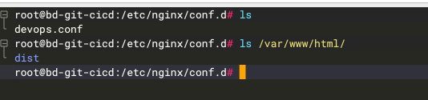
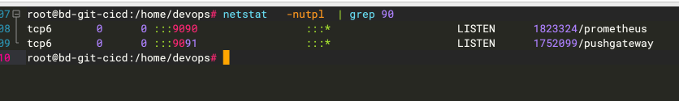
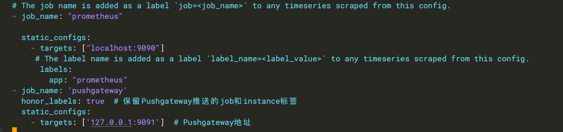
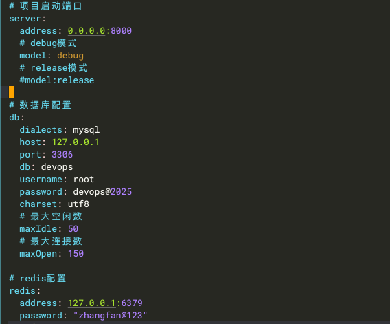
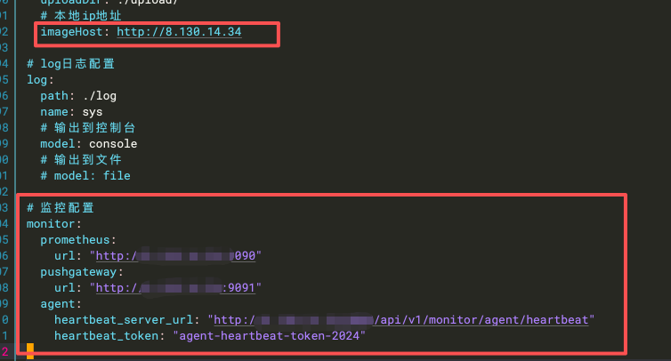

# DevOps运维管理系统 API

## 项目简介

DevOps运维管理系统是一个基于 Go + Gin 框架开发的企业级运维自动化平台，提供主机管理、配置中心、任务调度、K8s集群管理、监控告警等功能模块。

### 测试环境
http://180.76.231.65/login
账号：test
密码：123456

## 技术栈

### 后端框架
- **Gin** - Web框架
- **GORM** - ORM框架
- **JWT** - 身份认证
- **Swagger** - API文档
- **Logrus** - 日志管理
- **Robfig/Cron** - 定时任务调度

### 数据存储
- **MySQL** - 关系型数据库
- **Redis** - 缓存/消息队列

### 监控与追踪
- **Prometheus** - 监控指标采集
- **Pushgateway** - 指标推送

### 容器编排
- **Kubernetes** - K8s集群管理
- **client-go** - K8s客户端

### 云平台SDK
- **Tencent Cloud SDK** - 腾讯云资源管理
- **Baidu Cloud SDK** - 百度云资源管理

## 核心功能模块

### 1. CMDB（配置管理数据库）
- 主机资产管理
- 主机分组管理
- SSH连接管理
- SQL数据库管理
- 云资源管理（腾讯云、百度云）
- SQL操作日志审计

### 2. 配置中心
- 密钥管理（SSH密钥、API密钥）
- ECS云主机认证
- 账号权限管理
- 配置同步调度

### 3. 任务中心
- Ansible任务编排
- 任务模板管理
- 定时任务调度
- 任务执行监控
- WebSocket实时日志
- 任务队列系统

### 4. K8s集群管理
- 多集群管理
- Namespace管理
- Workload管理（Deployment、StatefulSet、DaemonSet）
- Service & Ingress管理
- ConfigMap & Secret管理
- 存储管理（PV、PVC、StorageClass）
- 节点管理
- 事件查看
- WebShell终端

### 5. 应用管理
- Jenkins集成
- 应用发布管理
- 构建历史

### 6. 监控告警
- Prometheus指标采集
- Pushgateway指标推送
- Agent心跳监控
- 系统资源监控

### 7. 系统管理
- 用户管理
- 角色权限
- 菜单管理
- 部门管理
- 岗位管理
- 操作日志
- 登录日志
- 验证码

### 8. 数据看板
- 运维数据统计
- 可视化展示

## 快速开始

## 安装步骤
### 环境要求
1. go version go1.24.6 linux/amd64
2. mysql Ver 8.0.33 以上
3. redis 5.0.0 以上
4. nginx 1.18.0 以上
5. 监控配置 安装prometheus+pushgateway 
注意事项，mysql连接密码认证方式需要修改
-- 修改 root@127.0.0.1 使用 caching_sha2_password
ALTER USER 'root'@'127.0.0.1' IDENTIFIED WITH caching_sha2_password BY 'devops@2025';
-- 刷新权限
FLUSH PRIVILEGES;
-- 验证
SELECT user, host, plugin FROM mysql.user WHERE user = 'root';

## 1. 配置前端
* 拷贝dist/               项目到 /var/www/html/
* 拷贝devops.conf配置文件到  /etc/nginx/conf.d/ 
* 修改nginx配置文件  

* 启动nginx服务
nginx -s reload
## 2. 配置后端
git clone https://github.com/zhang1024fan/deviops.git
mkdir -p /home/devops/{logs,upload}
cp -r deviops/devops          /home/devops/   #后端项目
cp -r deviops/config.yaml     /home/devops/   #配置文件
cp -r deviops/devops.sql      /home/devops/   #sql文件
cp -r deviops/devops.service  /etc/systemd/system/  #服务启动脚本
### 导入sql 
mysql -u root -p'xxxxxx'   < /home/devops/devops.sql
### 安装监控工具
prometheus+pushgateway 

mkdir -p /opt/prometheus/
cd /opt/prometheus/
wget https://github.com/prometheus/prometheus/releases/download/v2.47.0/prometheus-2.47.0.linux-amd64.tar.gz
tar -zxvf prometheus-2.47.0.linux-amd64.tar.gz
wget https://github.com/prometheus/pushgateway/releases/download/v1.6.1/pushgateway-1.6.1.linux-amd64.tar.gz
修改 prometheus.yml 配置

tar -xvf prometheus-2.47.0.linux-amd64.tar.gz
cp prometheus.service  /etc/systemd/system/
cp pushgateway.service  /etc/systemd/system/
systemctl daemon-reload
systemctl start prometheus.service
systemctl start pushgateway.service
### 修改配置文件  /home/devops/config.yaml

### 启动服务
systemctl daemon-reload
systemctl start devops.service

###  访问地址
http://192.168.1.1
admin/admin@2025

## 技术交流+社区
- 作者wx：zf5391621
- QQ群：925037324
- 邮箱：zfwh1024@163.com
- 项目地址：https://github.com/zhang1024fan/deviops.git

---

**注意：** 生产环境部署前请务必修改默认密码和密钥配置！
