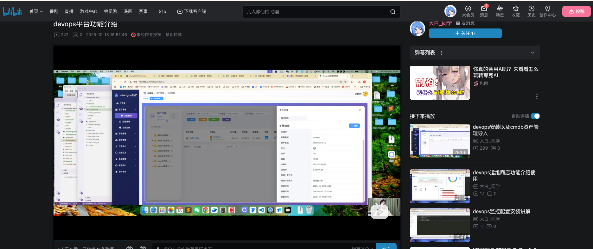
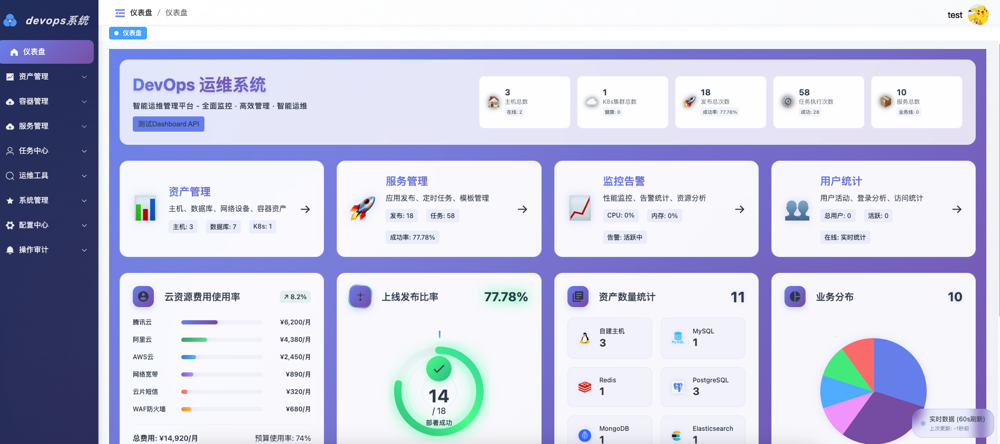

# 天枢AutoOps运维管理系统

## 项目简介

天枢AutoOps运维管理系统是一个基于 Go + vue3 框架开发的企业级运维自动化平台，提供以下核心能力主机管理、配置中心、任务调度、K8s集群管理、监控告警等功能模块。统一平台，全栈治：打破 CI/CD、监控、CMDB、K8s、工单等系统孤岛，数据互通、策略统


## 功能清单

<details>
<summary><b>📋 点击展开完整功能列表</b></summary>

| 功能模块 | 功能项 | 状态 |
|---------|--------|------|
| **CMDB资产管理** | 主机管理 | ✅ |
| | 云主机管理 | ✅ |
| | 云密钥管理 | ✅ |
| | 主机终端管理 | ✅ |
| | 五类数据库管理(MySQL/PgSQL/Redis/ES/MongoDB) | ✅ |
| **Kubernetes集群管理** | 多集群管理 | ✅ |
| | 节点管理 | ✅ |
| | Pod容器管理 | ✅ |
| | 容器配置-存储-配置-网络-路由管理 | ✅ |
| | K8s监控功能 | 🚧 开发中 |
| | K8s集群HPA自动扩缩容 | 🚧 开发中 |
| **服务管理** | 应用管理 | ✅ |
| | 应用快速发布-对接Jenkins可视化快速发布 | ✅ |
| | 应用工单上线流程发布 | ✅ |
| | 应用脚本上线工单 | ✅ |
| | 应用管理全局视图 | 🚧 开发中 |
| **监控中心** | 域名监控 | ✅ |
| | 主机基础资源监控 | ✅ |
| | 主机告警 | 🚧 开发中 |
| | 故障管理 | ✅ |
| | 数据库告警 | 🚧 开发中 |
| | 告警推送 | 🚧 开发中 |
| | 域名SSL证书申请 | 🚧 开发中 |
| **任务中心** | 定时任务 | ✅ |
| | 普通脚本任务(Shell/Python) | ✅ |
| | Ansible Playbook任务 | ✅ |
| **运维工具** | 常用运维资源安装 | ✅ |
| | Agent监控工具安装 | ✅ |
| **配置中心** | 主机凭据管理 | ✅ |
| | 通用资源账号管理 | ✅ |
| | 云资源密钥管理 | ✅ |
| **操作审计** | 登录日志审计 | ✅ |
| | 操作日志审计 | ✅ |
| | 数据库操作审计 | ✅ |
| | 终端录像审计 | 🚧 开发中 |
| **系统管理** | 用户管理 | ✅ |
| | 角色管理-RBAC授权 | ✅ |
| | 菜单管理-菜单-路由-安全权限管理 | ✅ |
| | 部门管理 | ✅ |
| | LDAP认证集成管理 | ✅ |
| | 飞书-钉钉-微信-邮件集成 | 🚧 开发中 |
| **后续开发功能** | SQL工单系统 | 📋 规划中 |
| | 运维工单系统 | 📋 规划中 |
| | 运维全局巡检报告 | 📋 规划中 |
| | 优化运维仪表盘 | 📋 规划中 |
| | AI大模型分析功能 | 📋 规划中 |

</details>


### 优势对比

<details>
<summary><b>🔍 点击展开优势对比详情</b></summary>

#### DevOps运维管理系统优势
✅ **轻量级** - 单体应用，部署简单，资源占用少
✅ **全栈运维** - 同时管理传统主机和K8s集群，无需多套系统
✅ **开箱即用** - 内置CMDB、任务调度、SQL审计等企业级功能
✅ **二次开发友好** - Go语言，代码结构清晰，易于定制
✅ **成本低** - 无商业授权费用，适合中小企业
✅ **中文友好** - 国内开发，文档和支持更贴合国内使用习惯

## 核心竞争力分析
与传统运维平台相比，本系统在**自动化程度**、**一体化整合**、**可观测性**、**安全合规**、**扩展性与智能化演进**等维度展现显著优势：

---

### 1️⃣ 高度集成的一体化架构

| 对比维度 | 传统平台 | DevOps运维管理系统 |
|---------|---------|------------------|
| **系统构成** | 多个孤立工具拼凑（Zabbix + Ansible + CMDB） | 统一平台深度整合 |
| **数据流转** | 数据割裂，需手动同步 | 数据打通，实时联动 |
| **操作体验** | 多系统切换，操作繁琐 | 一个系统管全部，协同高效 |
| **核心价值** | ❌ 信息孤岛严重 | ✅ 消除信息孤岛，提升协同效率 |

---

### 2️⃣ 面向云原生的深度支持

| 对比维度 | 传统平台 | DevOps运维管理系统 |
|---------|---------|------------------|
| **技术栈** | 聚焦物理机/虚拟机 | 原生支持Kubernetes |
| **容器管理** | 支持薄弱或需插件 | 多集群管理、Pod/配置/网络/存储全要素管控 |
| **弹性伸缩** | 手动或简单脚本 | HPA自动扩缩容（规划中） |
| **核心价值** | ❌ 云原生支持不足 | ✅ 贴合现代微服务与容器化架构 |

---

### 3️⃣ 发布与工单流程深度融合

| 对比维度 | 传统平台 | DevOps运维管理系统 |
|---------|---------|------------------|
| **发布方式** | 手动脚本或简单CI | Jenkins可视化快速发布 |
| **变更管控** | 缺乏审批流程 | 工单审批流程 + 脚本上线工单 |
| **可追溯性** | 记录不完整 | 全流程可视化 + 操作审计 |
| **核心价值** | ❌ 审批、追溯能力弱 | ✅ 兼顾敏捷性与合规性 |

---

### 📊 总结对比

```
传统运维平台痛点：
├─ 🔴 工具碎片化 → 多系统切换，数据孤岛
├─ 🔴 流程不闭环 → 发布、审批、审计分离
├─ 🔴 云原生支持弱 → 难以适配容器化架构
└─ 🔴 智能化缺失 → 依赖人工经验判断

DevOps运维管理系统优势：
├─ 🟢 一体化设计 → 统一平台，数据打通
├─ 🟢 云原生原生支持 → K8s深度集成
├─ 🟢 合规审计 → 完整操作追溯
└─ 🟢 智能化演进 → AIOps技术前瞻性
```

> **💡 核心定位**：构建**高效、安全、可扩展且面向未来**的新一代智能运维中枢，远超传统运维平台的能力边界。

### 适用场景建议

| 场景 | 推荐方案 |
|------|---------|
| 中小企业混合环境（VM + K8s） | **DevOps运维管理系统** |
| 纯K8s环境，预算充足 | KubeSphere 或 Rancher |
| 多云多集群大规模部署 | Rancher |
| 国内企业，注重云原生完整性 | KubeSphere |
| 快速上线，资源有限 | **DevOps运维管理系统** |
| 需要传统运维+容器化双轨并行 | **DevOps运维管理系统** |

</details>

### 测试环境
http://139.9.205.38/login
账号：test
密码：123456
### 视频安装使用介绍
https://www.bilibili.com/video/BV179Wxz1Ez6/?vd_source=37f81c1b36b3818cbad621bcbe5c3e49



## 安装步骤
docker一键安装
[docker部署文档](docker/README.md)
#### 拉取镜像(可选,首次部署会自动拉取)
```bash
docker pull crpi-aj3vgoxp9kzh2jx4.cn-hangzhou.personal.cr.aliyuncs.com/zhangfan_k8s/deviops-api:v1.0
docker pull crpi-aj3vgoxp9kzh2jx4.cn-hangzhou.personal.cr.aliyuncs.com/zhangfan_k8s/deviops-web:v1.0
docker pull crpi-aj3vgoxp9kzh2jx4.cn-hangzhou.personal.cr.aliyuncs.com/zhangfan_k8s/pushgateway:v1.9.0
docker pull crpi-aj3vgoxp9kzh2jx4.cn-hangzhou.personal.cr.aliyuncs.com/zhangfan_k8s/redis:7.0-alpine
docker pull crpi-aj3vgoxp9kzh2jx4.cn-hangzhou.personal.cr.aliyuncs.com/zhangfan_k8s/prometheus:v2.47.0
docker pull crpi-aj3vgoxp9kzh2jx4.cn-hangzhou.personal.cr.aliyuncs.com/zhangfan_k8s/mysql:8.0.33
```


### 修改配置文件
```bash
* git clone https://github.com/zhang1024fan/deviops.git
* cd  deviops/docker

vim  api/config.yaml

  # 本地ip地址(替换为实际的外网IP或域名)
  imageHost: "http://192.168.2.123:8088"
# 监控配置
monitor:
  prometheus:
    url: "http://192.168.2.123:9090"
  pushgateway:
    url: "http://192.168.2.123:9091"
  agent:
    heartbeat_server_url: "http://192.168.2.123:8000/api/v1/monitor/agent/heartbeat"
```

```bash
docker-compose up -d
### 2. 查看服务状态
docker-compose ps
### 3. 查看服务日志
docker-compose logs -f
### 4.访问服务
Web 前端: http://localhost:8088
默认账号: admin / 123456
```

## 感谢以下同学对本项目提供的打赏

<p align="center">
  
  
  
  
  
  
  
</p>

## 联系作者

## 技术交流+社区


#### 加群技术交流
