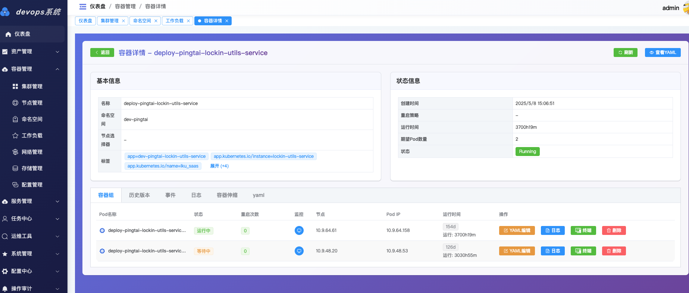
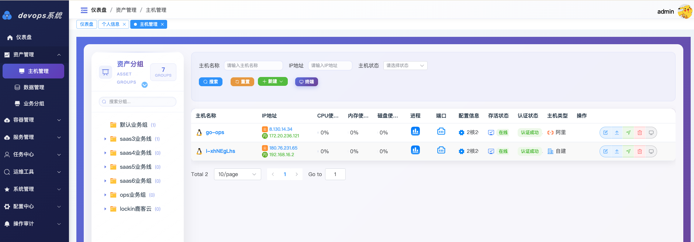

# DevOps运维管理系统 API

## 项目简介

DevOps运维管理系统是一个基于 Go + Gin 框架开发的企业级运维自动化平台，提供主机管理、配置中心、任务调度、K8s集群管理、监控告警等功能模块。

## 产品对比

### 与主流 K8s 管理平台对比

| 对比项 | DevOps运维管理系统 | KubeSphere | Rancher |
|--------|-------------------|------------|---------|
| **定位** | 轻量级运维自动化平台 | 企业级容器平台 | 企业级多云容器管理平台 |
| **部署复杂度** | ⭐ 简单（单体应用） | ⭐⭐⭐ 复杂（微服务架构） | ⭐⭐⭐ 复杂（分布式架构） |
| **资源占用** | ⭐ 低（< 512MB） | ⭐⭐⭐ 高（> 4GB） | ⭐⭐⭐ 高（> 2GB） |
| **学习曲线** | ⭐ 平缓 | ⭐⭐⭐ 陡峭 | ⭐⭐ 中等 |
| **K8s管理** | ✅ 支持多集群 | ✅ 支持多集群 | ✅ 支持多集群 |
| **传统主机管理** | ✅ 原生支持 | ❌ 不支持 | ❌ 不支持 |
| **CMDB** | ✅ 内置 | ❌ 需要集成 | ❌ 需要集成 |
| **Ansible集成** | ✅ 原生支持 | ❌ 需要二次开发 | ❌ 需要二次开发 |
| **SQL审计** | ✅ 开发中 | ❌ 不支持 | ❌ 不支持 |
| **云平台管理** | ✅ 腾讯云/百度云/阿里云 | ❌ 不支持 | ✅ 多云支持 |
| **定时任务** | ✅ Cron调度 | ✅ CronJob | ✅ CronJob |
| **监控告警** | ✅ Prometheus | ✅ 完整监控体系 | ✅ 完整监控体系 |
| **CI/CD** | ✅ Jenkins集成 | ✅ DevOps流水线 | ✅ Pipeline |
| **应用商店** | ❌ 不支持 | ✅ 应用商店 | ✅ Helm应用市场 |
| **服务网格** | ❌ 不支持 | ✅ Istio集成 | ✅ Istio集成 |
| **多租户** | ✅ 基础支持 | ✅ 完整支持 | ✅ 完整支持 |
| **API文档** | ✅ Swagger | ✅ API Gateway | ✅ RESTful API |
| **开源协议** | MIT | Apache 2.0 | Apache 2.0 |
| **社区活跃度** | ⭐⭐ 发展中 | ⭐⭐⭐⭐⭐ 活跃 | ⭐⭐⭐⭐⭐ 活跃 |
| **商业支持** | ❌ 无 | ✅ 青云QingCloud | ✅ SUSE |

### 优势对比

#### DevOps运维管理系统优势
✅ **轻量级** - 单体应用，部署简单，资源占用少
✅ **全栈运维** - 同时管理传统主机和K8s集群，无需多套系统
✅ **开箱即用** - 内置CMDB、任务调度、SQL审计等企业级功能
✅ **二次开发友好** - Go语言，代码结构清晰，易于定制
✅ **成本低** - 无商业授权费用，适合中小企业
✅ **中文友好** - 国内开发，文档和支持更贴合国内使用习惯

#### DevOps运维管理系统劣势
❌ **功能广度** - 相比成熟产品功能模块较少
❌ **生态系统** - 插件和扩展生态不如主流平台
❌ **企业级特性** - 服务网格、应用商店等高级功能缺失
❌ **社区规模** - 社区活跃度和文档完善度有待提升

#### KubeSphere优势
✅ **功能完整** - 企业级容器平台全栈解决方案
✅ **云原生** - 完整的DevOps、微服务治理、多租户能力
✅ **可观测性** - 日志、监控、追踪、告警、审计全覆盖
✅ **应用商店** - 丰富的应用模板和Helm Chart

#### KubeSphere劣势
❌ **资源消耗大** - 最低配置要求高，不适合小规模部署
❌ **只管K8s** - 无法管理传统虚拟机和物理机
❌ **学习成本高** - 功能复杂，上手门槛较高

#### Rancher优势
✅ **多云管理** - 支持AWS、Azure、阿里云等多云平台
✅ **集群管理** - 强大的K8s集群生命周期管理
✅ **企业级** - 成熟的权限体系和安全策略
✅ **商业支持** - SUSE提供企业级技术支持

#### Rancher劣势
❌ **复杂度高** - 架构复杂，运维成本较高
❌ **只管容器** - 无法管理传统主机和数据库
❌ **部署重** - 需要额外部署管理集群

### 适用场景建议

| 场景 | 推荐方案 |
|------|---------|
| 中小企业混合环境（VM + K8s） | **DevOps运维管理系统** |
| 纯K8s环境，预算充足 | KubeSphere 或 Rancher |
| 多云多集群大规模部署 | Rancher |
| 国内企业，注重云原生完整性 | KubeSphere |
| 快速上线，资源有限 | **DevOps运维管理系统** |
| 需要传统运维+容器化双轨并行 | **DevOps运维管理系统** |

### 测试环境
http://180.76.231.65/login
账号：test
密码：123456

## 技术栈


### 后端框架
- **Gin** - Web框架
- **GORM** - ORM框架
- **JWT** - 身份认证
- **Swagger** - API文档
- **Logrus** - 日志管理
- **Robfig/Cron** - 定时任务调度

### 数据存储
- **MySQL** - 关系型数据库
- **Redis** - 缓存/消息队列

### 监控与追踪
- **Prometheus** - 监控指标采集
- **Pushgateway** - 指标推送

### 容器编排
- **Kubernetes** - K8s集群管理
- **client-go** - K8s客户端

### 云平台SDK
- **AlIyun Cloud SDK** -  阿里云云资源管理
- **Tencent Cloud SDK** - 腾讯云资源管理
- **Baidu Cloud SDK** -   百度云资源管理

## 核心功能模块

### 1. CMDB（配置管理数据库）
- 主机资产管理
- 主机分组管理
- SSH连接管理
- SQL数据库管理
- 云资源管理（腾讯云、百度云）
- SQL操作日志审计(未开发)

### 2. 配置中心
- 密钥管理（SSH密钥、API密钥）
- ECS云主机认证
- 账号权限管理
- 配置同步调度

### 3. 任务中心
- Ansible任务编排
- 任务模板管理
- 定时任务调度
- 任务执行监控
- WebSocket实时日志
- 任务队列系统

### 4. K8s集群管理
- 多集群管理
- Namespace管理
- Workload管理（Deployment、StatefulSet、DaemonSet）
- Service & Ingress管理
- ConfigMap & Secret管理
- 存储管理（PV、PVC、StorageClass）
- 节点管理
- 事件查看
- WebShell终端

### 5. 应用管理
- Jenkins集成
- 应用发布管理
- 构建历史

### 6. 监控告警
- Prometheus指标采集
- Pushgateway指标推送
- Agent心跳监控
- 系统资源监控

### 7. 系统管理
- 用户管理
- 角色权限
- 菜单管理
- 部门管理
- 岗位管理
- 操作日志
- 登录日志
- 验证码

### 8. 数据看板
- 运维数据统计
- 可视化展示

## 快速开始
[视频教程](https://www.bilibili.com/video/BV1pyWxzQEVj/?spm_id_from=333.1387.homepage.video_card.click&vd_source=37f81c1b36b3818cbad621bcbe5c3e49)
## 安装步骤
docker一键安装
[docker部署文档](docker/README.md)
#### 拉取镜像(可选,首次部署会自动拉取)
```bash
docker pull crpi-aj3vgoxp9kzh2jx4.cn-hangzhou.personal.cr.aliyuncs.com/zhangfan_k8s/deviops-api:v1.0
docker pull crpi-aj3vgoxp9kzh2jx4.cn-hangzhou.personal.cr.aliyuncs.com/zhangfan_k8s/deviops-web:v1.0
docker pull crpi-aj3vgoxp9kzh2jx4.cn-hangzhou.personal.cr.aliyuncs.com/zhangfan_k8s/pushgateway:v1.9.0
docker pull crpi-aj3vgoxp9kzh2jx4.cn-hangzhou.personal.cr.aliyuncs.com/zhangfan_k8s/redis:7.0-alpine
docker pull crpi-aj3vgoxp9kzh2jx4.cn-hangzhou.personal.cr.aliyuncs.com/zhangfan_k8s/prometheus:v2.47.0
docker pull crpi-aj3vgoxp9kzh2jx4.cn-hangzhou.personal.cr.aliyuncs.com/zhangfan_k8s/mysql:8.0.33
```
```bash
git clone https://github.com/zhang1024fan/deviops.git
cd  deviops/docker
docker-compose up -d
### 2. 查看服务状态
docker-compose ps
### 3. 查看服务日志
docker-compose logs -f
### 4.访问服务
Web 前端: http://localhost:8088
默认账号: admin / 123456
```

## 更新修复计划
1. 修复 模版下载失败问题，优化xlsl模版参数变量，模版导入支持公钥认证
2. 修复配置中心 按钮权限无法点击选择问题
3. 优化初始化sql参数   测试数据删除不需要参数
4. 修复前端访问webSocket失败问题（cmdb资产管理/k8s容器管理终端）
......
## 联系作者

## 技术交流+社区
- wx：zf5391621
- QQ：545118130
- 邮箱：zfwh1024@163.com
- 项目地址：https://github.com/zhang1024fan/deviops.git
#### 加群

